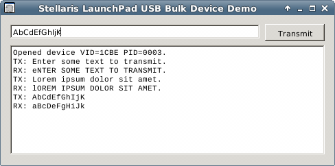

Stellaris-LaunchPad-UsbDevBulk-AutoWinusbInstall
================================================

This is a working demonstration of how to automatically install the generic Windows WinUSB.sys driver using only device firmware descriptors on the TI Stellaris LaunchPad.  That's right -- **NO .INF file**, **NO co-installer hassles**, and **NO 32 vs 64-bit nonsense**.  It doesn't even matter what your VID/PID are (assuming they don't match something that Windows already has a driver/INF for).  Simply plug in your device and Windows will figure out what to do.  Your application is then good to go communicating with your firmware via a fat bulk pipe.  So now you can quit using the HID class to skirt around the whole driver thing.

The ability to do this is somewhat recent to Windows.  For Windows 8 the support is fully baked in, but for prior versions Windows will gladly pull down what it needs via Windows Update.  I've read that this will work as far back as WinXP SP3, but I have not personally tried it.  I developed this demo on Win7 x64, using Code Composer Studio v5.2.1.00018 and StellarisWare version 9453.

This demo focuses on bulk USB transfers.  It is derived from the TI StellarisWare "usb_dev_bulk" example.  As an added bonus, a C# host application example is included as an alternative to the C example app provided by TI.


##How it Works
In a nutshell, the first time Windows enumerates a device with a particular VID & PID, it will send a "probe" request for a magic string descriptor at index 0xEE called the "Microsoft OS String Descriptor".  Most devices will just reject this request, but if you respond to it correctly, Windows will then follow up with additional special Vendor Requests.  One of these special Vendor Requests in particular, the "Microsoft Compatibility ID Feature Descriptor", allows your firmware to specify to Windows to load a certain generic driver.  Recently Microsoft added the WinUSB.sys driver to the list of Compatibility IDs, and so that's what we're going to leverage here.

I won't reiterate all of the gory details here.  To tell you the truth, after poring over the relative MSDN docs the process is much simpler than MSDN makes it seem.  Other folks have already distilled down the information and made it much less confusing.  If you are interested in the details I suggest you check out the [WCID Devices page](https://github.com/pbatard/libwdi/wiki/WCID-Devices#wiki-Other) for [libwdi](https://github.com/pbatard/libwdi).  It was really helpful to me in getting the kinks worked out and really helped clarify some of the aspects I wasn't getting out of the MSDN docs. 


##StellarisWare usblib Hacks
I had to make a change internal to usblib in order for this to work.  I tried to do so as elegantly as possible and within the conventions already established by usblib.  Rather than kludge in the code to respond to the 0xEE request directly in usblib/device/usbdenum.c, I instead opted to add a callback to tCustomHandlers.  This new callback is named `pfnGetStringDescriptor` and is invoked whenever the USB host requests a string descriptor that is not in your static string descriptor table.

The other thing I had to do was change the USB version designator in the device descriptor.  For some reason usblib sets this to 0x110 (v1.1) with the comment _"USB version 1.1 (if we say 2.0, hosts assume high-speed - see USB 2.0 spec 9.2.6.6)"_.  I don't think this is true.  Certainly the USB 2.0 spec provides for Full-Speed devices, which is what we have here.  I'm not sure why you'd ever want to specify 1.1.  (If you have any insight into this, please drop me a line.)  The problem this causes is that Windows will never bother asking for the special 0xEE "Microsoft OS String Descriptor" unless your device descriptor specifies version 2.0 or higher.

Fortunately I was able to get this done from outside of usblib, since the global g_sBulkDeviceInfo is accessible from outside of the library.  Here's what that looks like:

````C
unsigned short * const pwUsbVersion = (unsigned short *)(g_sBulkDeviceInfo.pDeviceDescriptor + 2);
*pwUsbVersion = 0x200;
````  

Other than that, usblib is the same.  I'd really like to see TI roll these changes into usblib.  The Stellaris demos already involve use of WinUSB.sys, and this would just make it that much better and effortless.


##How to Integrate This Into Your Project
All I've done is taken the stock "usb_dev_bulk" project and rigged it up with callback handlers to induce the automatic installation of WinUSB.sys, using my modified usblib.  You should be able to build and run this code on your LaunchPad and mess around with it the same as the stock TI demo project, using the "usb_bulk_example" Visual C++ project supplied in StellarisWare.  You can also move some traffic around with the C# example host app I've included too (see below).

1. Copy the usb_dev_bulk and usblib folders to a subdirectory of your choosing in your CCS workspace, then import the two projects.  You’ll want to select the cm4f project (for CCS) when asked – that’s what will run on your Stellaris LaunchPad.

2. Then you’ll need to rename or relocate the c:/ti/StellarisWare/usblib (or wherever it is on your system) to avoid #include conflicts.  Don’t forget to put this back later on if you need to use the stock usblib.

3. You can build and run the usb_dev_bulk project if you just want to do a simple test run. If you want to add this functionality to an existing project, then follow these additional steps.

4. In your project, you’ll need to add the following references to the modified usblib:
	1. Add a project dependency to usblib.
	2. Add a #include path to the directory containing usblib.
	3. Add a linker input to usblib-cm4f.lib

5. Copy the code from usb_dev_bulk.c surrounded by the `/** @region "WinUSB auto-load routines" */` `/** @endregion */` comments into a suitable location in your target project.

6. Add a call to `ConfigureAutoWinUsbInstall()` at a suitable place in your code.  Right before the call to `USBDBulkInit` works perfect.

7. Assuming that you have previously enumerated and loaded a driver (WinUSB or otherwise) for your device, you’ll need to take some steps to get Windows to forget about it so that next time it will go through the full discovery process and probe for 0xE, etc.  Otherwise if Windows already knows exactly what to do for that VID/PID then it won’t bother to initiate the WinUSB auto-load process.  You can either:
	1. Change your VID/PID to something new.  Or,
	2. Delete the device entry in Device Manager and then delete the following registry keys:
		1. In `HKEY_LOCAL_MACHINE\SYSTEM\CurrentControlSet\Control\usbflags` delete the key for your device that is in the form `VID+PID+BCD_RELEASE_NUMBER`
		2. In `HKEY_LOCAL_MACHINE\SYSTEM\CurrentControlSet\Enum\USB` delete the key in the form `VID_####&PID_####` for your device.

##The C# Example Host Application
In the `HostApp` subdirectory there is a simple C# .NET host application that allows you to send and receive data with your device.  It's nothing spectacular, just a bare-bones WinForms app with an edit box, a Transmit button, and a logging box.  The functionality is essentially the same as the TI supplied C usb_bulk_example console app.  

I've opted to use the [LibUsbDotNet](http://sourceforge.net/projects/libusbdotnet/) library to provide the interface to the WinUSB driver.  Though this library hasn't been updated in a few years, it seems to do it's job well and brings the benefit of automatically working with multiple low-level USB layers, WinUSB being one of them.  It will also recognize and work with [libusb](http://www.libusb.org/) on Linux/Mono.  My expectation is that my device and application will work on Linux without code changes -- but I haven't gone down that path yet.  Wouldn't that be cool?! (Drop me a line if you have any insight/advice on this).

####DeviceInterfaceGUIDs vs. DeviceInterfaceGUID
In my original firmware, I had it sending `DeviceInterfaceGUID` (REG_SZ) to the host when asked for the Microsoft Extended Properties Feature Descriptor just like the MSDN docs say to do.  When trying to use LibUsbDotNet, I immediately ran into problems getting it to find my device.  It turns out that LibUsbDotNet is hardcoded to look for `DeviceInterfaceGUIDs` as part of locating WinUSB devices.  As such, it won't identify a WinUSB device that sends `DeviceInterfaceGUID`.  

What I learned is that in the years prior, whenever you created an .INF file to load WinUSB the old way, you included something like this:
```
[Dev_AddReg]
HKR,,DeviceInterfaceGUIDs,0x10000,"{6E45736A-2B1B-4078-B772-B3AF2B6FDE1C}"
```
That's actually straight out of the TI usb_dev_bulk.inf file, but there's plenty of examples out there doing the same thing. So it's perfectly normal, in fact I'll go so far as to say de facto, that you specify the multiple-form `DeviceInterfaceGUIDs` containing exactly one GUID.

So I changed the firmware to instead send `DeviceInterfaceGUIDs` REG_MULTI_SZ with just the one GUID.  LibUsbDotNet worked perfectly after that.

Interestingly, the TI example app "usb_bulk_example" works either way... `DeviceInterfaceGUID` (REG_SZ) or `DeviceInterfaceGUIDs` (REG_MULTI_SZ).  I believe this is because it hands the GUID to Windows SetupDi directly, and SetupDi is cool with either descriptor -- it knows what's going on.

####Linux
Using [libusb](http://www.libusb.org/).


##TODO
- Fix other build targets & platforms.  At this point I've only configured Debug.
- Add prebuilt usblib binaries.

##References
https://github.com/pbatard/libwdi/wiki/WCID-Devices  **Very helpful**

http://msdn.microsoft.com/en-us/library/windows/hardware/gg463179.aspx

http://msdn.microsoft.com/en-us/library/windows/hardware/hh450799(v=vs.85).aspx


##History
<dl>
  <dt>2013-09-04</dt>
	<dd>Verified that the HostApp runs on Linux and communicates with the device!  I had to make a few minor changes in the HostApp code to get there.  I'll update the docs pertaining to Linux and also the prerequisite steps I had to take.</dd>

  <dt>2013-06-11</dt>
  <dd>
  	<ul>
	<li>Added C# host application example using LibUsbDotNet.</li>
	<li>Changed firmware to send "DeviceInterfaceGUIDs" (plural) as a REG_MULTI_SZ instead of "DeviceInterfaceGUID" as a REG_SZ. This complies with de facto standards established by prior .INF files for loading the WinUSB driver, and alllows LibUsbDotNet to locate the device.</li>
	</ul>
  </dd>

  <dt>2013-06-08</dt>
  <dd>Completed implementation of the Microsoft Extended Properties Feature Descriptor in order to send the DeviceInterfaceGUID to the host.</dd>
  
  <dt>2013-06-04</dt>
  <dd>Initial commit of functional code.</dd>
</dl>
